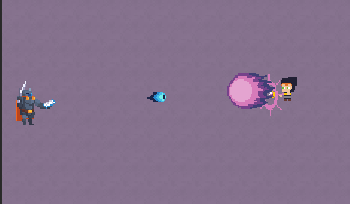

# RL2 — Reinforcement Learning in Rogue-Likes

A compact 2D roguelike-inspired game built to test one idea: **can a boss enemy learn to fight, instead of being scripted?**

The player finds themselves in an empty room, can choose to clear up to three item rooms (weapon, armor, consumables), then faces a single boss whose combat behavior is controlled by a PyTorch PPO policy trained through reinforcement learning, instead of a hand-authored behavior tree. The game (Godot 4, C#) and the AI (Python) are two separate processes that talk to each other in real time over a WebSocket.

This is an academic thesis project exploring the feasibility of using reinforcement learning in the game development pipeline. The full research framing, hypothesis and success criteria live in [`docs/project_brief.md`](docs/project_brief.md); the complete gameplay/mechanics spec lives in [`docs/game_design.md`](docs/game_design.md). This README is the technical entry point: what's in the repo, how the pieces fit together, and how to run or (re)build everything yourself.

[](docs/screenshot.png)

---

## Contents

- [Architecture](#architecture)
- [Repository layout](#repository-layout)
- [Main modules](#main-modules)
  - [Game client — `Game/ai_boss/`](#game-client--gameai_boss-c-godot-46)
  - [AI server — `Game/server/`](#ai-server--gameserver-python)
  - [Wire protocol](#wire-protocol)
- [Running it in development](#running-it-in-development)
- [Training a new policy](#training-a-new-policy)
- [Reproducing a distributable build](#reproducing-a-distributable-build)
- [Playing the game](#playing-the-game)
- [Docs, credits & license](#docs-credits--license)

---

## Architecture

Two independent processes, one connection:

```
┌───────────────────────────┐        ws://localhost:7000          ┌───────────────────────────┐
│      Godot 4 client        │   custom fixed-size binary proto   │      Python PPO server    │
│      Game/ai_boss/ (C#)    │ ─────────────────────────────────▶│      Game/server/          │
│                            │◀───────────────────────────────── │                            │
└───────────────────────────┘        ACTION (movement + action id)└───────────────────────────┘
```

Every frame while the boss fight is active:

1. The Godot client serializes the current match state (`GameStateSerializer.cs`) and sends a `DYNAMIC_STATE` packet.
2. The server flattens it into a 56-dimensional observation vector (`game/collector.py`) and asks the shared policy for an action (`ai/policy.py` → `ai/agent.py`).
3. The server replies with an `ACTION` packet (movement direction + one of 7 discrete action ids).
4. `BossRL.cs` executes the action through its state machine; `BossAttackManager.cs` maps the action id to a concrete attack.

When an episode ends (win/lose/timeout), the client sends `OUTCOME`; in training mode this triggers reward computation, GAE, and — once enough experience has accumulated — a PPO update.

---

## Repository layout

```
AI_Roguelike/
├── Game/
│   ├── ai_boss/          Godot 4 project (C#) — the playable game
│   └── server/            Python server — RL training + inference
├── docs/
│   ├── game_design.md     Full gameplay/mechanics spec
│   ├── project_brief.md   Thesis framing, objectives, tech stack
│   └── copyright.md       Third-party asset attributions
└── build/                 Build output (gitignored — see "Reproducing a build")
```

---

## Main modules

### Game client — `Game/ai_boss/` (C#, Godot 4.6)

| Folder | What lives there |
|---|---|
| `scripts/entities/Enemies/` | `BossRL.cs` (the ML-controlled boss, state machine Idle → Walking → Attacking → Cooldown → Dead, 2000 HP), `BossAttackManager.cs` (maps a server action id to a concrete attack); plain scripted enemies (`EnemyEntity.cs`) |
| `scripts/entities/Playable_character/` | `PlayableCharacter.cs` (base class for player interactions, excludes input handling) and `PlayerMimic.cs` (scripted/AI-driven stand-in for the player used during training) |
| `scripts/attack_types/` | One class per attack shape (melee, charged melee, projectile, charged projectile, chain, crescent sweep, dash-melee…), shared via `IAttack`/`IChargeable`/`IShootable` |
| `scripts/combat/consumables/` | `Consumable.cs` + effect strategies (`InstantHealEffect` = Potion, `RegenerationEffect` = Medkit) |
| `scripts/player_inputs/` | `Weapon.cs`/`WeaponBase.cs` (per-weapon stats), `Armor.cs` (speed/damage/knockback modifiers), `PlayerController.cs` (input reading, gated on pause state) |
| `scripts/room_management/` | `Room.cs`/`RoomState.cs` base + one script per room (`WeaponRoom`, `ArmorRoom`, `ConsumableRoom`, `BossRoom`) |
| `scripts/hud/` | Health bars, cooldown indicators, pause menu, the training-only telemetry overlay (`TrainingData.cs`), the pre-fight `ReadyBoss.cs` overlay, and the post-fight `EndScreen.cs` (shared by `WinScreen`/`DeathScreen`) |
| `scripts/visual_effects/` | Per-entity visual controllers (flash/blink/fade on hit, facing-direction sprites) and the camera controller |
| `scripts/tools/GameStateSerializer.cs` | Hand-rolled binary (de)serialization for the wire protocol — **must stay byte-for-byte in sync with `network/protocol.py`** |
| `scripts/GlobalState.cs` | Singleton holding the shared static/dynamic match state read by the serializer |
| `scripts/MainHandler.cs` | Owns the WebSocket connection lifecycle (connect/retry/reconnect) and, in exported builds only, launches and later kills the bundled inference-server process |

### AI server — `Game/server/` (Python)

| Module | Responsibility |
|---|---|
| `main.py` | WebSocket server entry point (`ws://localhost:7000`); routes connections; drives the training loop |
| `inference_server.py` | Zero-argument entry point for the *packaged* server (hardcodes inference mode + CPU, resolves `policies/final_policy.pt` next to the executable) |
| `network/connection.py` | `PacketHandler` — one per client connection; calls the policy each frame, queues completed episodes for training |
| `network/protocol.py` | Binary encode/decode for every message type |
| `network/state.py` | `SessionState` — static + dynamic state for one connection |
| `ai/policy.py` | `HybridPPOPolicy` — the shared `torch.nn.Module` |
| `ai/agent.py` | `BossAI` — wraps the shared policy behind `choose_action()` / `on_episode_end()` |
| `game/collector.py` | `flatten_observation()` — game-state structs → 56-dim normalized tensor |
| `game/rewards.py` | `RewardTracker` — per-step and terminal reward shaping |
| `game/player_config.py` | `PlayerFactory` — generates varied player configurations for training diversity |
| `training/trainer.py` | `PPOTrainer` — PPO update with GAE (4 epochs, minibatch 64, lr 3e-4) |
| `training/training_manager.py` | `TrainingManager` — owns the shared policy instance, batch queue, checkpointing |
| `training/orchestrator.py` | `TrainingOrchestrator` — spawns and monitors multiple concurrent Godot instances for centralized training |
| `training/trajectory_collector.py` | Per-episode trajectory assembly; skips scoring while the boss is in a locked animation state |
| `utils/device.py` | Picks CUDA if available, else CPU (training only — the packaged inference server always forces CPU) |

### Wire protocol

Fixed-size binary messages, little-endian, matching C#'s `BinaryWriter`:

| Message | Id | Direction | Size | Sent |
|---|---|---|---|---|
| `STATIC_STATE` | 0 | client → server | 73 bytes | once per episode (equipment stats + room bounds) |
| `DYNAMIC_STATE` | 1 | client → server | 151 bytes | every frame (player/boss/projectile state) |
| `OUTCOME` | 2 | client → server | 2 bytes | once, on episode end (win/lose) |
| `COMMAND` | 3 | client → server | 2 bytes | control messages (e.g. reset) |
| `ACTION` | 10 | server → client | 12 bytes | every frame in response to `DYNAMIC_STATE` (`float x, float y, int32 action_id`) |

`STATIC_STATE` + `DYNAMIC_STATE` are flattened and normalized into a **56-dim observation vector** (15 static + 41 dynamic) fed to the policy, which outputs continuous movement `(x, y)` plus a 7-way discrete action id (idle/attacks/dash — see `BossAttackManager.cs` for the mapping). If you change what's captured in the game state, you must update `GameStateSerializer.cs`, `network/protocol.py`, **and** `game/collector.py` together, or the two sides will silently desync.

---

## Running it in development

### Prerequisites

- **Godot 4.6.1** (.NET/Mono build) + a matching **.NET SDK 8.0** (the project targets `net8.0`)
- **Python 3.10+** (developed against 3.14) with `pip`
- A CUDA-capable GPU is optional — training auto-detects it and falls back to CPU

### 1. Start the AI server

```bash
cd Game/server
pip install -r requirements.txt

# Training — spawns Godot instance(s) and trains the shared policy
python main.py --mode=training --num-instances=1

# Inference — plays a pre-trained checkpoint, no learning
python main.py --mode=inference --policy-path=policies/final_policy.pt
```

The server listens on `ws://localhost:7000`.

### 2. Run the game

Open `Game/ai_boss/project.godot` in the Godot editor and press Play. `MainHandler.cs` detects it's running from the editor (`OS.HasFeature("editor")`) and does **not** try to auto-launch a server — that's only for exported builds. **Start the Python server first**, or the client will just sit there retrying the connection.

---

## Training a new policy

`python main.py --mode=training --num-instances=N` spawns `N` visible (not headless) Godot instances running `scenes/train.tscn`, all feeding experience into one shared `HybridPPOPolicy` via `TrainingOrchestrator`. If `--godot-exec` isn't given, it auto-detects common Windows install paths.

- Training runs every 2 seconds once enough experience has queued (4+ finished episodes, or 512+ transitions — whichever comes first), rather than on a fixed timer, since a single fight can run 5–10 minutes.
- Checkpoints save to `Game/server/checkpoints/` every 10 training steps.
- Training stops on `--max-episodes=N`, on a detected performance plateau, or Ctrl+C — either way the final policy is saved on shutdown.
- Useful flags: `--port=N`, `--debug-collisions`, `--debug-navigation`.

Reward shaping (`game/rewards.py`): `+0.4 × boss damage dealt − 0.6 × player damage received` per step, an anti-spam penalty for repeating the same action, `+10` for a win (with a close-fight bonus), `−10` for a loss, `−15` for a 10-minute timeout.

Once you're happy with a checkpoint, promote it by copying it into `Game/server/policies/` (e.g. as `final_policy.pt`) — that's the file both `--mode=inference` and the packaged `inference_server.py` load by default.

---

## Reproducing a distributable build

A shipped build is two artifacts sitting side by side: the exported Godot game, and a standalone (Python-free) build of the inference server. Everything lands under the top-level `build/` folder (gitignored).

### 1. Build the standalone inference server

```bash
cd Game/server
pip install pyinstaller   # not in requirements.txt — only needed for packaging
python build_inference_server.py
```

This runs PyInstaller (`--onefile`) and produces `build/server/ai_boss_inference_server.exe`. It does **not** bundle a policy on purpose, so the policy can be swapped without rebuilding — copy one over manually:

```
build/server/
├── ai_boss_inference_server.exe
└── policies/
    └── final_policy.pt
```

### 2. Export the Godot game

1. Make sure the **Windows Desktop** export templates matching your Godot version are installed (Editor → Manage Export Templates).
2. Open the project in Godot, go to **Project → Export…**, select the **Windows Desktop** preset.
3. Click **Export Project**. The preset's output path (`export_presets.cfg`) is already pinned to `../../build/rl2_game.exe`, i.e. the repo's top-level `build/` folder, so no path needs changing.

This produces `build/rl2_game.exe` plus a companion `build/data_AI_Boss_windows_x86_64/` folder (the .NET runtime + game assemblies — Mono/C# exports always need this folder alongside the exe, it isn't optional). Only a Windows Desktop preset exists today; there's no Linux/macOS export configured.

### 3. Assemble the distributable package

Zip these three things together from inside `build/`:

```
rl2_game.exe
data_AI_Boss_windows_x86_64/
server/
├── ai_boss_inference_server.exe
└── policies/
    └── final_policy.pt
```

That's the entire contents of a shippable `rl2.zip` — nothing outside these three is needed, and nothing inside them is optional.

### 4. Run it

Unzip and launch `rl2_game.exe`. Because this is an exported build (not the editor), `MainHandler.cs` now auto-launches `server/ai_boss_inference_server.exe` (resolved relative to its own exe path, not the working directory) as a companion process, and kills it again on exit. Players never need Python installed.

---

## Playing the game

From the starting room: **left** to the Weapon Room, **down** to the Consumable Room, **right** to the Armor Room, **up** to the Boss Room. The three item rooms can be cleared in any order (or skipped); the Boss Room ends the run on win/lose.

| Action | Key |
|---|---|
| Move | WASD |
| Primary attack | Left Mouse |
| Secondary attack | Right Mouse |
| Dodge | Space |
| Use consumable | Q |

Full mechanics (weapon stats, armor modifiers, consumables, room breakdown) are in [`docs/game_design.md`](docs/game_design.md).

---

## Docs, credits & license

- [`docs/project_brief.md`](docs/project_brief.md) — research question, hypothesis, MVP scope, evaluation plan, tech stack
- [`docs/game_design.md`](docs/game_design.md) — full gameplay/mechanics spec
- [`docs/copyright.md`](docs/copyright.md) — third-party font/sound attributions

This repository is licensed under [**CC BY 4.0**](LICENSE) — you're free to share and adapt anything here, including commercially, as long as you credit me. Third-party assets listed in [`docs/copyright.md`](docs/copyright.md) keep their own original licenses and aren't relicensed by this.
